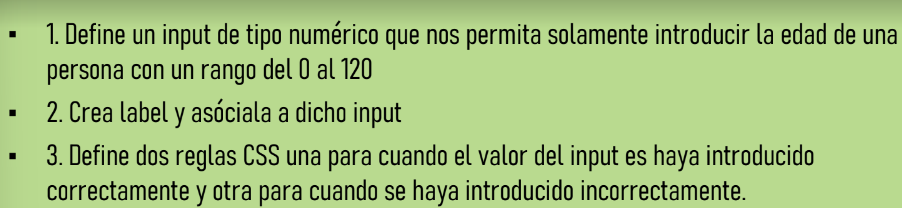

# Ejercicio 01 HTML (5)
## Pregunta 1 - Crea un repositorio en GitHub

  

## Pregunta 2 - Crear secciones del body

## Pregunta 4 - Utilizar la nav paara los enlaces principales

## Pregunta 5 - Crear secciones del body

## Pregunta 6 - Poner emoticono con hipervinvulo al inicio

# RESULTADO FINAL
