# JAVA SRIPT
## 1 - ALERT MEDIANTE EL NOMBRE GUARDADO EN VARIABLE
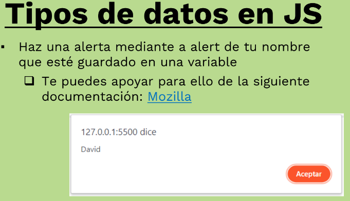
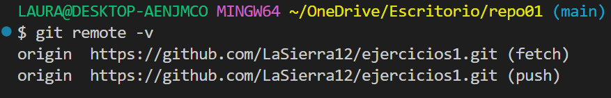

## 2 - PROMPT
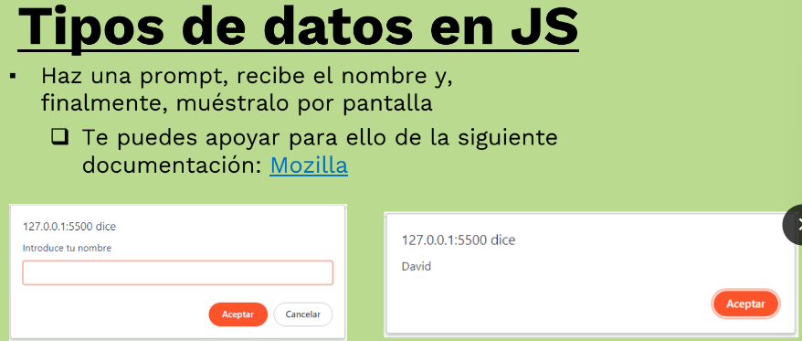
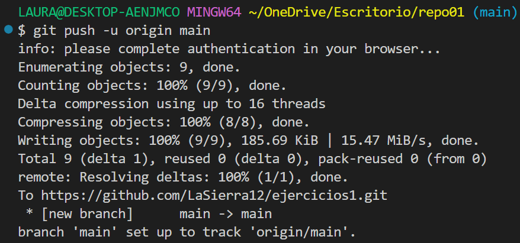
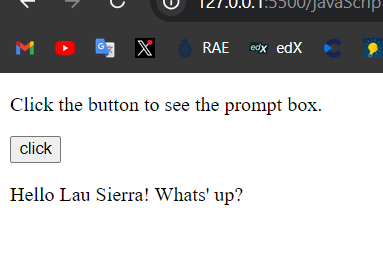

## EJERCICIO 01
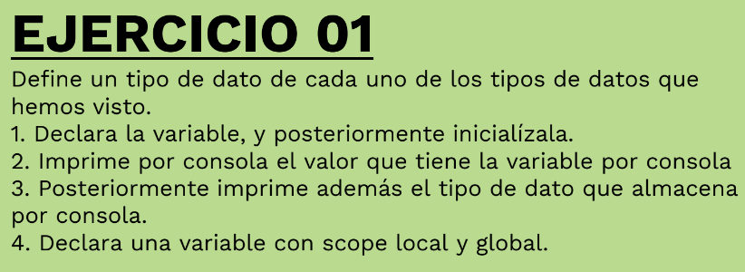
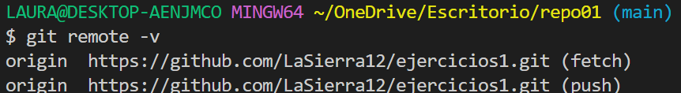
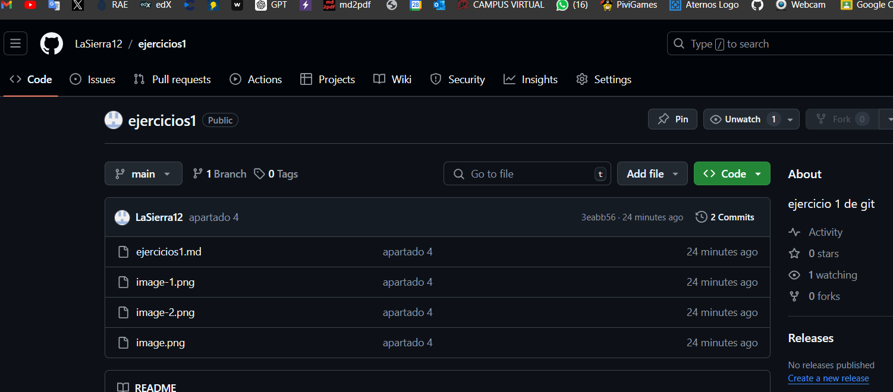

## EJERCICIO 02
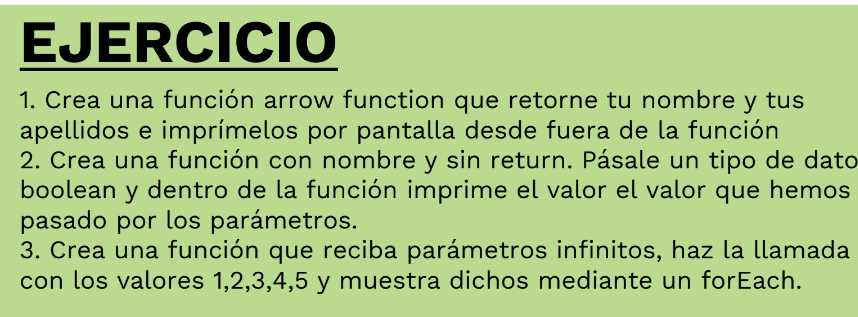
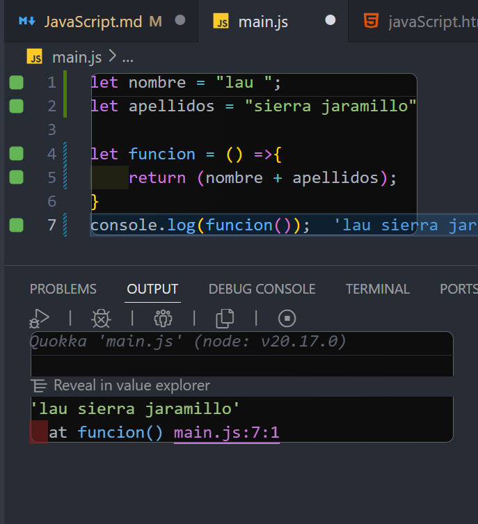
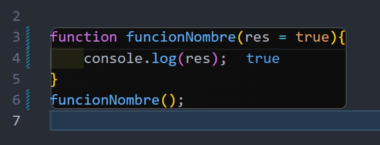
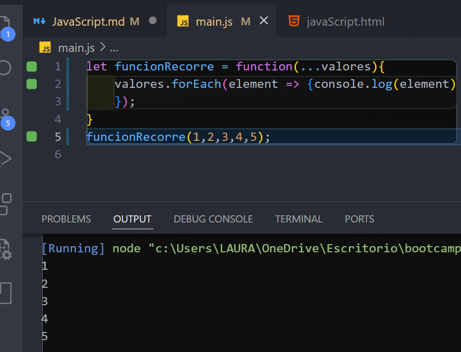

## EJERCICIO 03

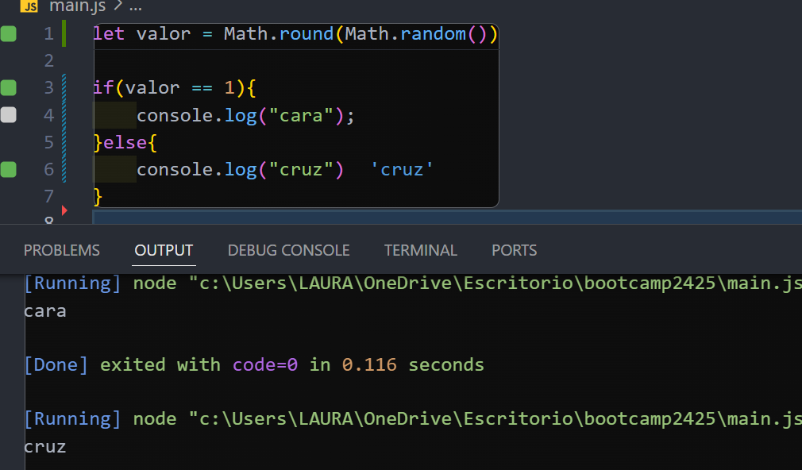

## EJERCICIOI 04

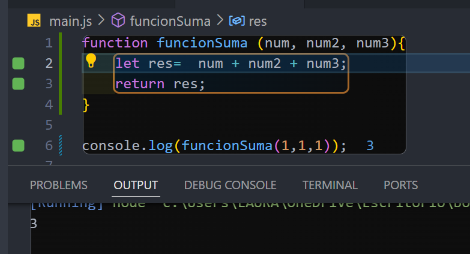
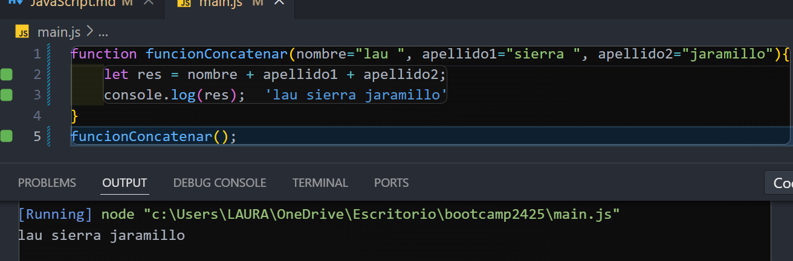
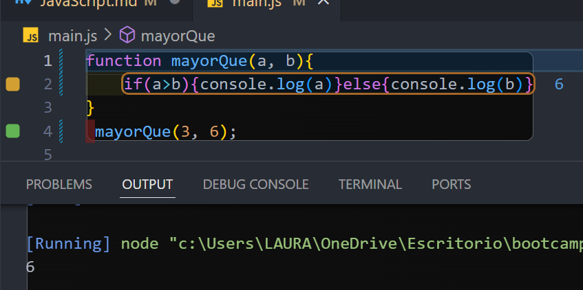

## EJERCICIO 05
![alt text]
(image-20.png)
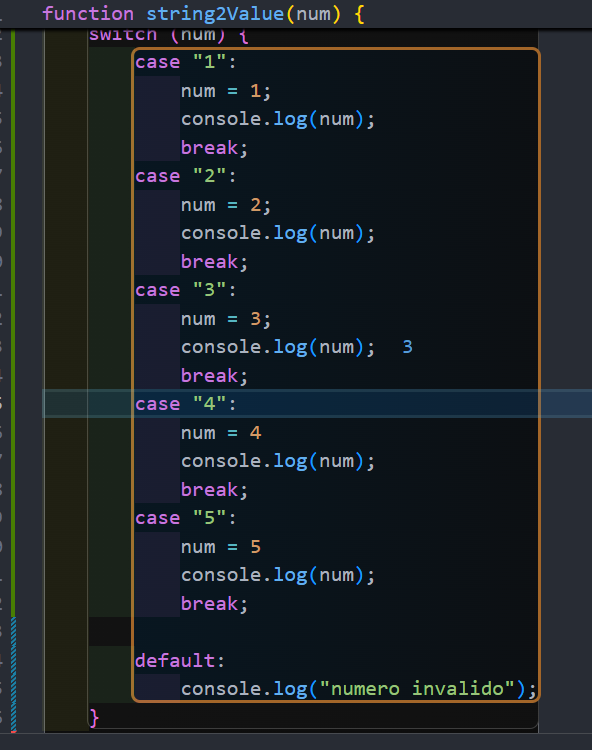

## EJERCICIO 06
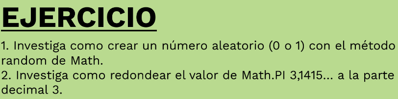
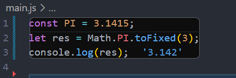

## EJERCICIO 07
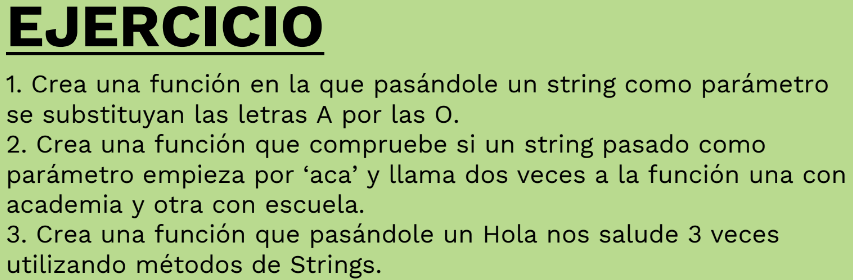
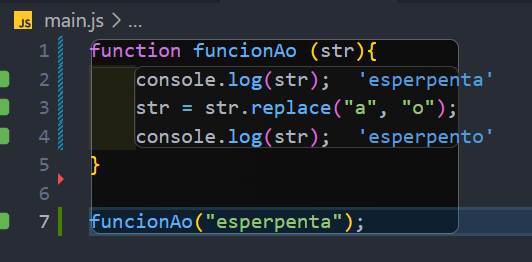
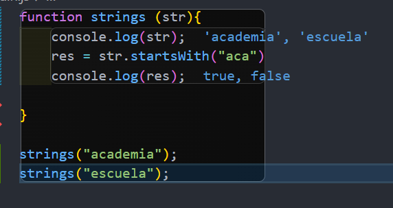
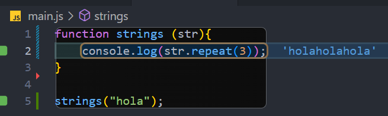

## EJERCICCIO 08

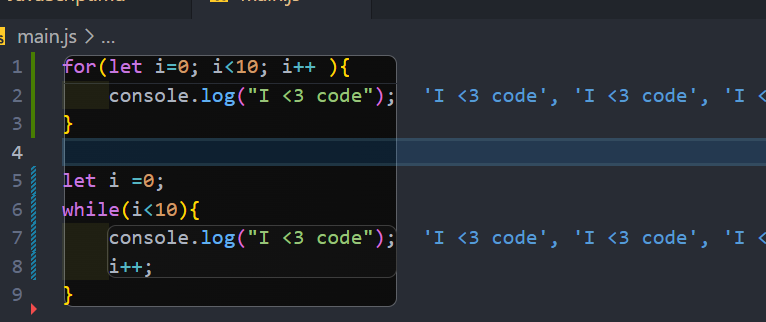

## EJERCICIO 09
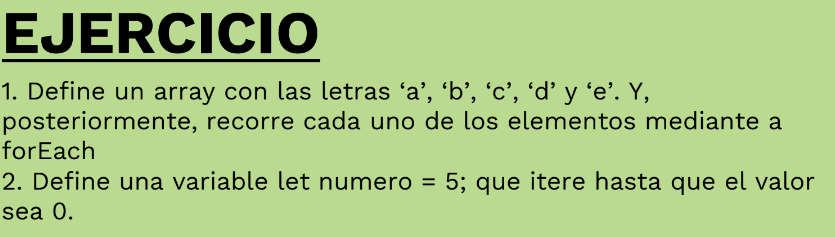
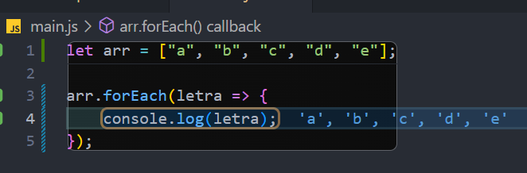
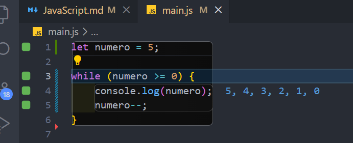

## EJERCICIO 10
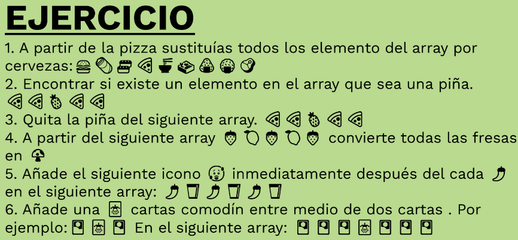
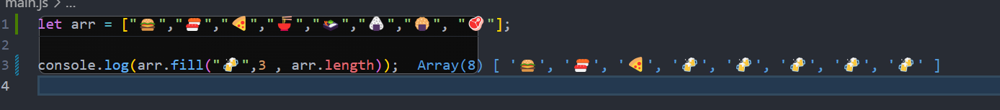
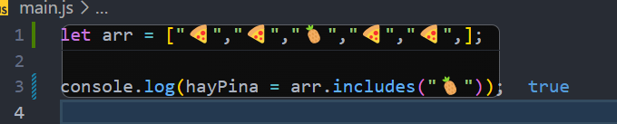

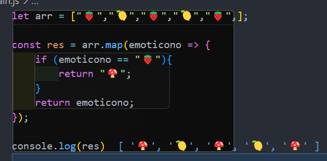
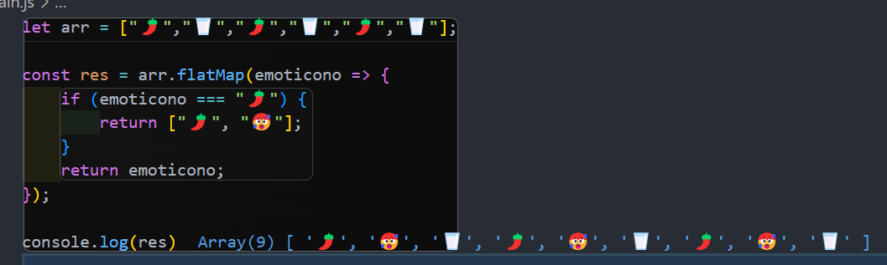
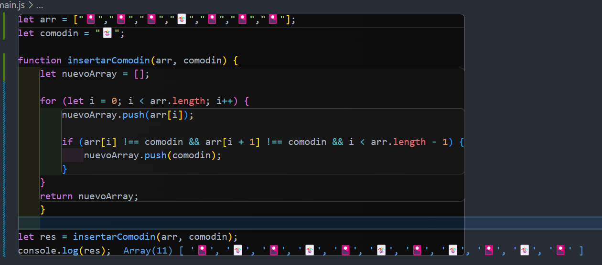