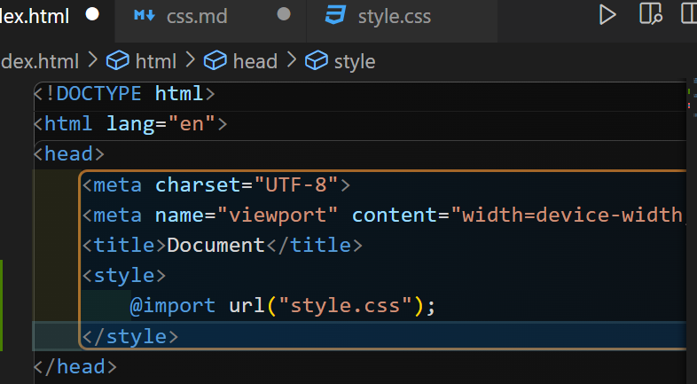
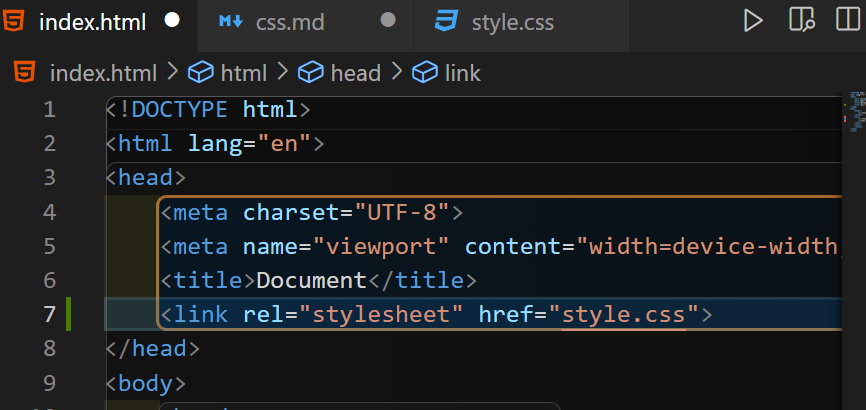
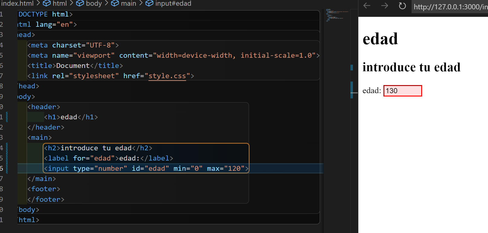
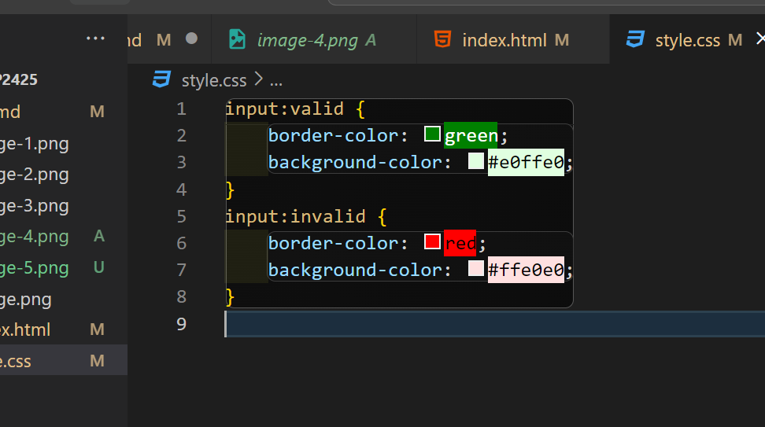
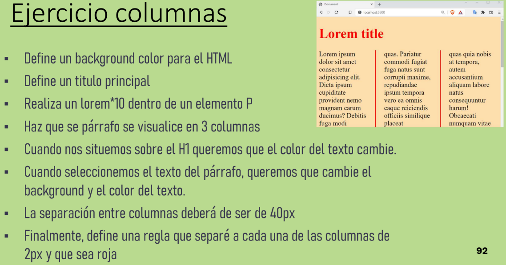
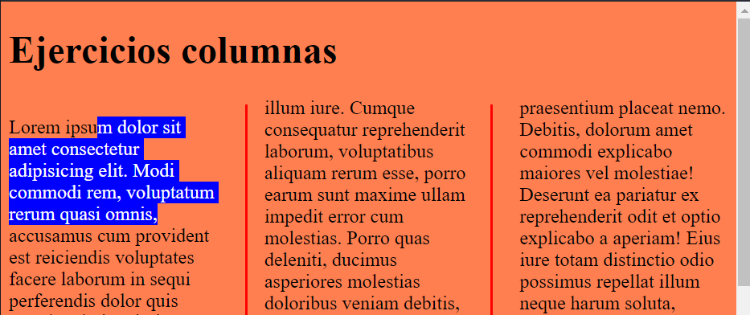
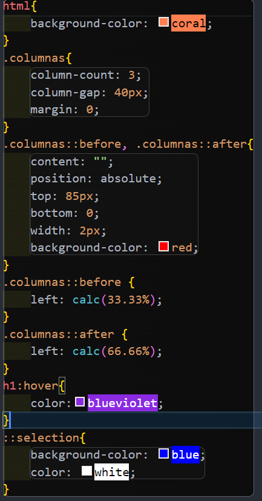
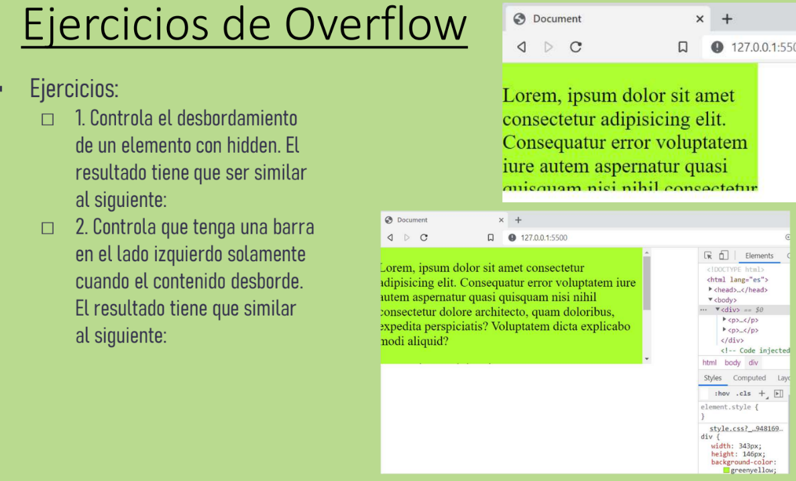

# EJERCICIOS DE CSS
## EJERCICIO 1
.png)
### Manera 1
.png)

### Manera 2 y 3

### Manera 4

## EJERCICIO 2 - INPUT CSS

### Apartado 1 y 2

### Apartado 3

## EJERCICIOS DE SELECTORES
## EJERCICIOS COLUMNAS

## EJERCICIOS OVERFLOW

