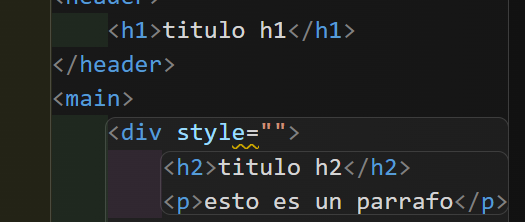
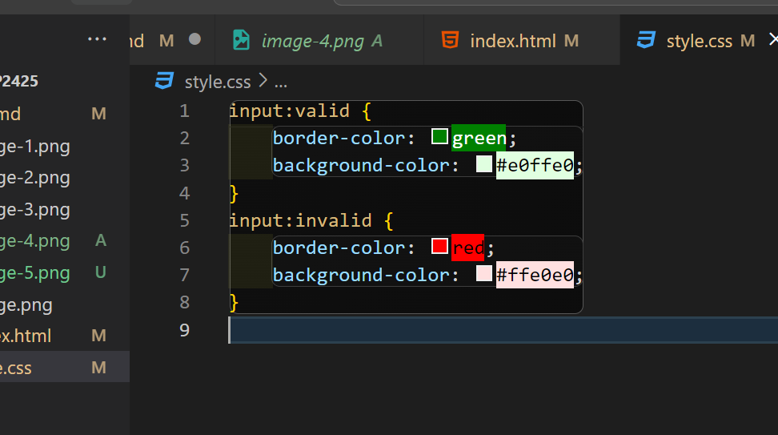
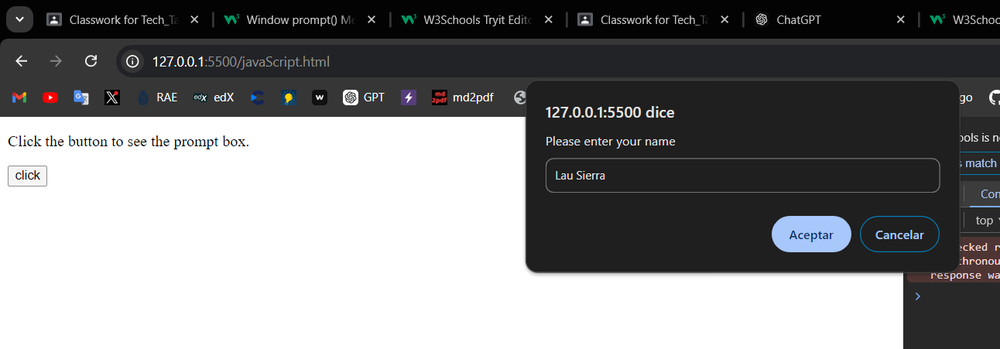
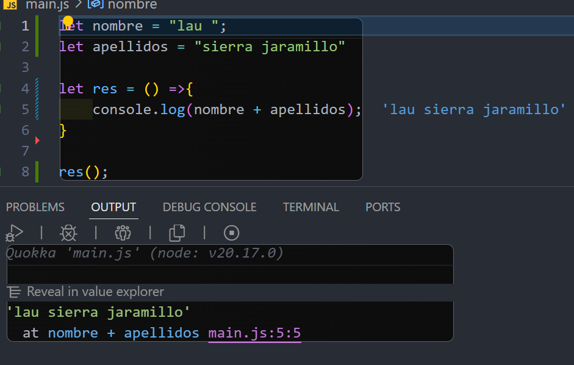

# EJERCICIOS GIT   (1)
### Ejercicio 1
Primeramente, he creado un directorio en mi escritorio, luego, he hecho click derecho, abrir en bash y seguidamente he puesto la informacion proporcionada en la captura.
  

### Ejercicio 2  
He creado el archivo en vs code y posteriormente, en la ventana de bash he usado los comandos para añadir este archivo .md al repositorio y para hacer un commit.

  

### Ejercicio 3  
Primero he hecho un git status, seguidamente un git add ejercicios1.md y luego he vuelto a hacer un git status.

  

### Ejercicio 4
Pasos para realizar el push

### Ejercicio 5, 6, 7
Al principio, al ejecutar el comando git remote -v no salia nada, y eso es debido a que nuestro repositorio no estaba enlazado con ningun repositorio remoto, luego lo enlazamos poniendo "git remote add origin https://github.com/LaSierra12/ejercicios1.git" en el bash y asi ya tendriamos la conexión hecha.

### Ejercicio 8
Primero hay que hacer un git add ., para subir al repositorio todo lo que tenemos dentro del directorio.
  

### Ejercicio 9

## ENUNCIADO

# EJERCICIOS GIT   (II)
## EJERCICIO 1 - Crear repositorio en GitHub

El repositorio creado es remoto.

## EJERCICIO 2 - Clonar repositorio